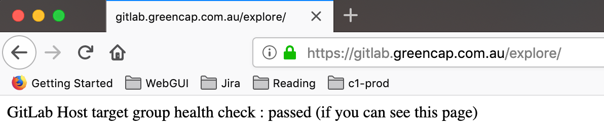
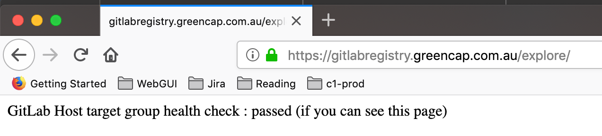

# provisioning gitlab server ee on an existing host

## hardware requirement

* the gitlab server and its supporting aws resources have been defined in [gitlab-server and its supporting infrastructure build guide](https://scode.greencap.com.au/devops/gitlab-server)

* sendgrid user account 
sendgrid user account for gitlab server aws production has been created successfully and recorded in secret manager.

## usage 

* get the new gitlab-server ec2 instance private ip address

```
$ aws ec2 describe-instances --profile dev --filters "Name=tag:Name,Values=gitlab-server" "Name=instance-state-name,Values=running"  --query "Reservations[].Instances[].PrivateIpAddress" --output text
173.120.15.188
$
```

* ensure the new gitlab-server ec2 instance can serve url https://gitlab.greencap.com.au/explore/ correctly



* ensure the new gitlab-server ec2 instance can serve url https://gitlabregistry.greencap.com.au/explore/ correctly



* clone this repo to linux jumpbox

```
 ~]$ git clone https://github.com/fen9li/gitlab-server-playbook.git
Cloning into 'gitlab-server-playbook'...
remote: Enumerating objects: 8, done.
remote: Counting objects: 100% (8/8), done.
remote: Compressing objects: 100% (6/6), done.
remote: Total 8 (delta 0), reused 5 (delta 0), pack-reused 0
Unpacking objects: 100% (8/8), done.
 ~]$ cd gitlab-server-playbook/
 gitlab-server-playbook]$
```

* configure / update new gitlab-server ec2 instance's private ip address in /home/ec2-user/gitlab-server-playbook/hosts file

```
 gitlab-server-playbook]$ vim hosts
 gitlab-server-playbook]$ cat hosts
[gitlab-server]
173.120.15.188
 gitlab-server-playbook]$ 
```

* run playbook to provision gitlab server

> YOU MUST REPLACE smtp_username AND smtp_password WITH YOUR REAL ONE   in BELOW ansible-playbook command! THE smtp_password SHOWED BELOW IS A FAKE ONE.

```
 gitlab-server-playbook]$ ansible-playbook -i hosts site.yml --extra-vars "smtp_username=apikey smtp_password=uk0#ncv3ALwX8aQW"

PLAY [gitlab-server] ****************************************************************************************************************

TASK [Gathering Facts] **************************************************************************************************************
ok: [173.120.15.188]

TASK [gitlab-server : Include OS-specific variables.] *******************************************************************************
ok: [173.120.15.188]

TASK [gitlab-server : uninstall httpd] **********************************************************************************************
changed: [173.120.15.188]

TASK [gitlab-server : Check if GitLab configuration file already exists.] ***********************************************************
ok: [173.120.15.188]

TASK [gitlab-server : Check if GitLab is already installed.] ************************************************************************
ok: [173.120.15.188]

TASK [gitlab-server : Download GitLab repository installation script.] **************************************************************
changed: [173.120.15.188]

TASK [gitlab-server : Install GitLab repository.] ***********************************************************************************
changed: [173.120.15.188]

TASK [gitlab-server : Define the Gitlab package name.] ******************************************************************************
skipping: [173.120.15.188]

TASK [gitlab-server : Install GitLab] ***********************************************************************************************
changed: [173.120.15.188]

TASK [gitlab-server : Reconfigure GitLab (first run).] ******************************************************************************
changed: [173.120.15.188]

TASK [gitlab-server : Copy GitLab configuration file.] ******************************************************************************
changed: [173.120.15.188]

RUNNING HANDLER [gitlab-server : restart gitlab] ************************************************************************************
changed: [173.120.15.188]

PLAY RECAP **************************************************************************************************************************
173.120.15.188             : ok=11   changed=7    unreachable=0    failed=0

 gitlab-server-playbook]$
```

* enter https://gitlab.greencap.com.au to reset root password, follow gitlab server recommended common practice to add new runners, groups, users, projects and you go.

## what to do next
* runners can also be coded
 
